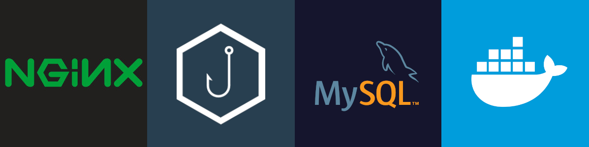

# Production Gophish

> Production ready docker-compose implementation of the Gophish phishing framework.



## Installation (Requires **Docker** and **docker-compose**)

```sh
<span style="color:#005cc5">git</span> clone Oxigen96/production_gophish / gh repo clone Oxigen96/production_gophish

cd production_gophish

docker-compose up -d
```

## Usage example

```text
1. Open your browser

2. Go to https://localhost:3333/

3. Log in with the one time only password given in the logs 
        -> $ docker-compose logs gophish

4. Start phishing 🎣
```

<!-- _For more examples and usage, please refer to the [Wiki][wiki]._ -->

## Development setup

Describe how to install all development dependencies and how to run an automated test-suite of some kind. Potentially do this for multiple platforms.

```sh
make install
npm test
```

<!-- ## Release History
* 0.2.1
    * CHANGE: Update docs (module code remains unchanged)
* 0.2.0
    * CHANGE: Remove `setDefaultXYZ()`
    * ADD: Add `init()`
* 0.1.1
    * FIX: Crash when calling `baz()` (Thanks @GenerousContributorName!)
* 0.1.0
    * The first proper release
    * CHANGE: Rename `foo()` to `bar()`
* 0.0.1
    * Work in progress -->

## Contributing

1. Fork it (<https://github.com/Oxigen96/production_gophish/fork>)
2. Create your feature branch (`git checkout -b feature`)
3. Commit your changes (`git commit -am 'Add some features'`)
4. Push to the branch (`git push origin feature`)
5. Create a new Pull Request 😄

## Thanks to

- [Andrew Long for having this project based upon his article](https://medium.com/swlh/production-ready-gophish-with-nginx-mysql-and-docker-68db412d6cdd)

## License

Distributed under the MIT license. See ``LICENSE`` for more information.

[wiki]: https://github.com/Oxigen96/production_gophish/wiki